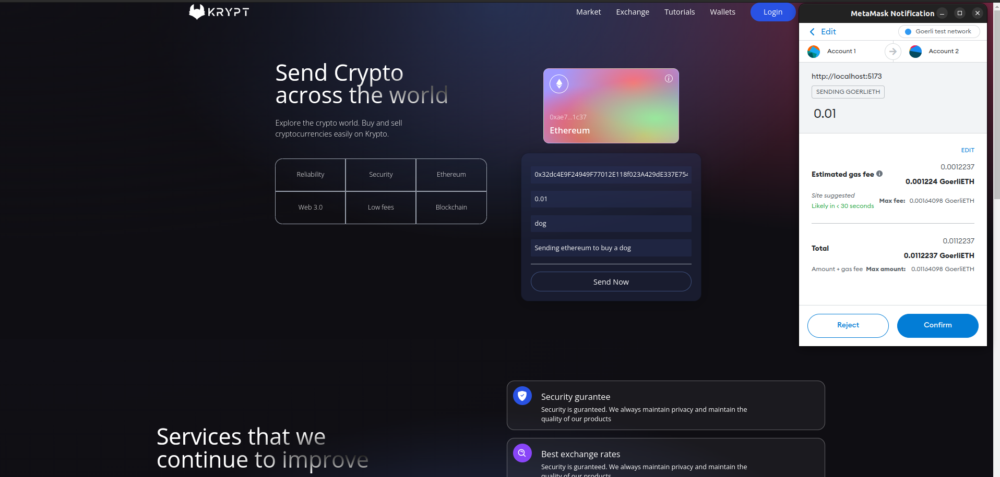

# Web 3.0

A simple Web 3.0 space app to send Ethereum from one account to another and view latest transactions.

## Client

### Technologies

`React, Tailwind, Vire, ethers, etc.`, and MetaMask browser plugin for confirming transactions and account details

## Smart Contract

This project demonstrates a basic Hardhat use case. It comes with a sample contract, a test for that contract, and a script that deploys that contract.

Try running some of the following tasks:

```shell
npx hardhat help
npx hardhat test
REPORT_GAS=true npx hardhat test
npx hardhat node
npx hardhat run scripts/deploy.js
```

### Technologies

`JavaScript, Solidity, and hardhat`

### Deployment

Hardhat is used to configure deployment on the Goerli network

### Some screenshots

- sending ethereum to an account



- Getting latest transaction


## Authors

- [Blaise Bakundukize](https://github.com/blaisebakundukize) - Initial work

## License

This project is licensed under the MIT License
